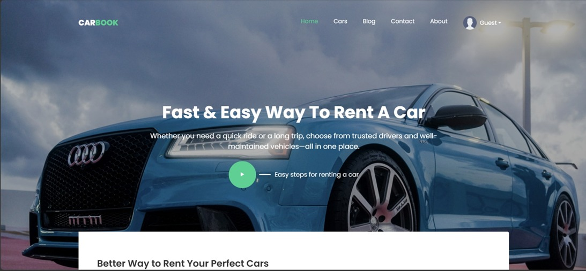
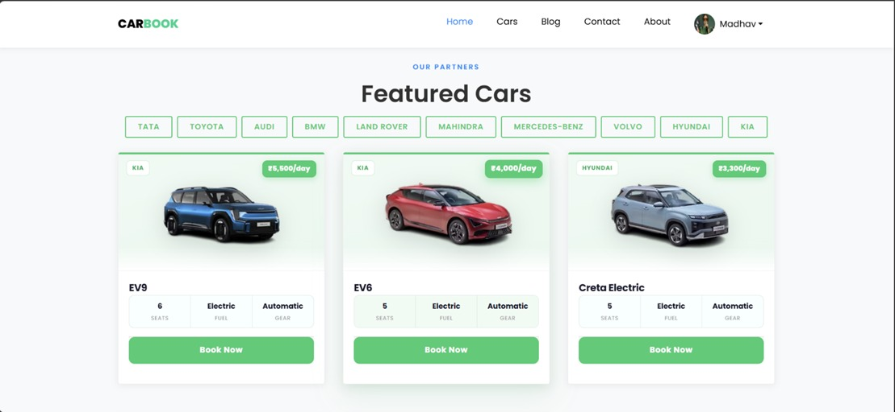
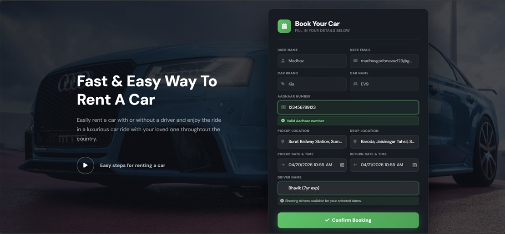
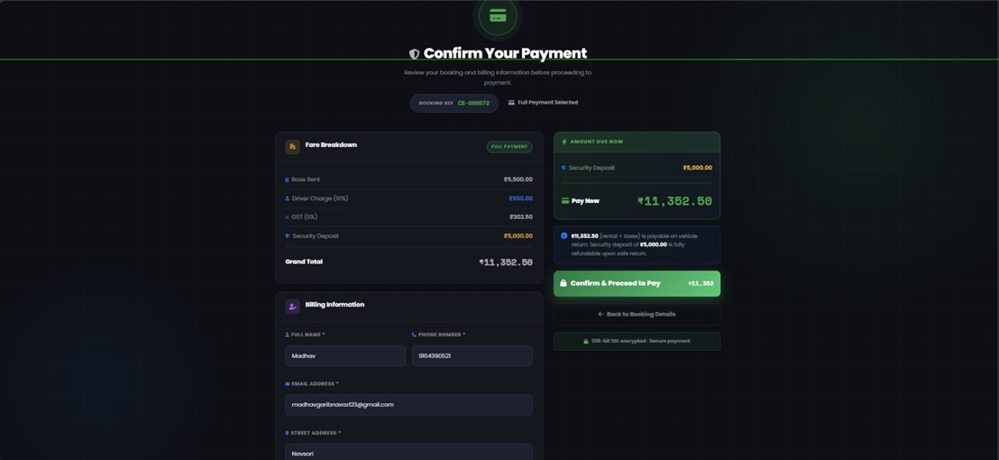
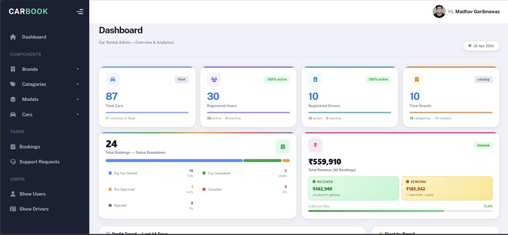
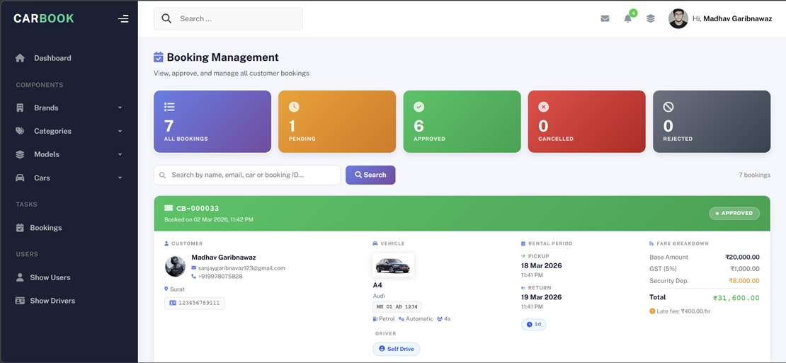
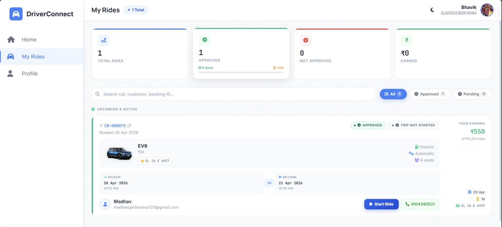
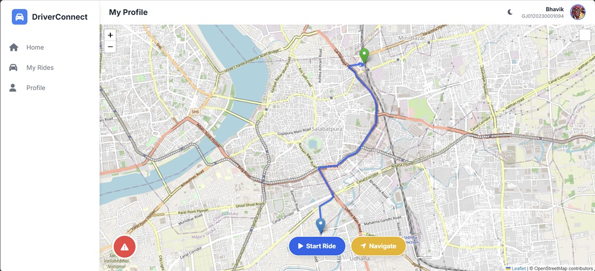

<div align="center">

# 🚗 CarBook — Car Rental Management System

[](https://www.php.net/)
[](https://www.mysql.com/)
[](https://getbootstrap.com/)
[](https://tailwindcss.com/)
[](https://razorpay.com/)
[](LICENSE)

**A full-stack web application for managing car rentals — with separate portals for customers, admins, and drivers, a booking approval workflow, Razorpay payments, and real-time map integration.**



</div>

---

## 📌 Overview

CarBook is a role-based car rental platform built with PHP and MySQL. It replaces manual rental workflows with a centralized system where customers browse and book cars online, admins control approvals and fleet management, and drivers handle trip execution through a dedicated dashboard.

The booking flow enforces an **admin-approval gate before payment** — ensuring every reservation is validated before any transaction is processed. Payments are handled via **Razorpay**, supporting both deposit-first and full-payment options.

---

## ✨ Features

- 🔐 **Role-based access** — separate portals for Customer, Admin, and Driver
- ✅ **Admin approval workflow** — bookings are approved before payment is unlocked
- 💳 **Razorpay integration** — deposit or full payment, with remaining balance paid later
- 📍 **Map support** — OpenStreetMap + Leaflet.js for pickup/drop location selection
- 🚫 **Double-booking prevention** — real-time date-range conflict validation
- 🧑‍✈️ **Driver management** — admin assigns drivers; drivers track and update trip status
- 📊 **Admin analytics** — revenue tracking, fleet status, booking breakdowns
- 📧 **PHPMailer** — OTP email verification and transactional notifications
- 📱 **Responsive design** — works across desktop and tablet via Bootstrap 5 + Tailwind CSS

---

## 👥 Module Summary

### 🙋 Customer
Register, browse and filter cars by category/fuel/price, select pickup & drop locations on map, choose self-drive or with-driver, submit booking, wait for admin approval, pay via Razorpay, view booking history, and cancel upcoming bookings.

### 🛠 Admin
Manage brands, categories, models, and vehicles with full CRUD. Approve or reject booking requests, assign drivers, monitor revenue, manage users and drivers, handle support requests, and view fleet availability status from a central dashboard.

### 🧑‍✈️ Driver
Log in after admin activation, set availability, view assigned bookings with map-based route, start and complete rides, update trip status, and track commission-based earnings per completed trip.

---

## 🔄 Booking Workflow

```
User selects car & dates
        │
        ▼
Real-time availability check
        │
        ▼
Booking form submitted → stored as PENDING
        │
        ▼
Admin reviews → APPROVED or REJECTED
        │
   [Approved]
        │
        ▼
Payment via Razorpay (deposit or full)
        │
        ▼
Driver assigned by admin
        │
        ▼
Driver starts ride → completes trip
        │
        ▼
Remaining payment settled (if deposit was used)
```

---

## 🛠 Tech Stack

| Layer | Technologies |
|-------|-------------|
| **Backend** | PHP 8.x (MySQLi / PDO), Apache via XAMPP |
| **Database** | MySQL 8.0, phpMyAdmin |
| **Frontend** | HTML5, CSS3, JavaScript (ES6+) |
| **UI Frameworks** | Bootstrap 5, Tailwind CSS 3 |
| **Charts** | ApexCharts, Chart.js |
| **Maps** | Leaflet.js, OpenStreetMap |
| **Payment** | Razorpay (test mode) |
| **Email** | PHPMailer (SMTP) |
| **Animations** | animate.css, wow.js, Owl Carousel, SweetAlert2 |
| **Package Managers** | Composer (PHP), npm (Node.js) |

---

## 🖼 Screenshots

| | |
|---|---|
|  |  |
| Home Page | Car Listing |
|  |  |
| Booking Form | Payment Page |
|  |  |
| Admin Dashboard | Booking Management |
|  |  |
| Driver Dashboard | Active Ride Map |

> Place screenshots in the `/screenshots/` directory matching the filenames above.

---

## ⚙️ Installation

### Prerequisites
- [XAMPP](https://www.apachefriends.org/) (Apache + PHP 8.x + MySQL)
- [Composer](https://getcomposer.org/)
- [Node.js](https://nodejs.org/) v16+ and npm

---

### 1. Clone & place in web root

```bash
git clone https://github.com/Madhav-Garibnawaz/carbook-car-rental-system.git
```

Move the project folder to:

```text
C:\xampp\htdocs\carbook
```

### 2. Import the database

Open `http://localhost/phpmyadmin`, create a database named `carbook`, then import:

```
database/carbook.sql
```

### 3. Configure the app

Edit `config/config.php`:

```php
define('DB_HOST', 'localhost');
define('DB_USER', 'root');
define('DB_PASS', '');
define('DB_NAME', 'carbook');
define('BASE_URL', 'http://localhost/carbook/');
```

### 4. Install PHP dependencies

```bash
composer install
```

> Installs **PHPMailer** — used for OTP verification during registration and transactional email notifications.

### 5. Install Node dependencies & build CSS

```bash
npm install
```

> Installs **ApexCharts** (admin analytics charts) and **Chart.js** (dashboard statistics visualization). Tailwind CSS is compiled from source during this step.

### 6. Configure Razorpay

Edit `config/razorpay.php`:

```php
define('RAZORPAY_KEY_ID',     'rzp_test_XXXXXXXXXXXX');
define('RAZORPAY_KEY_SECRET', 'XXXXXXXXXXXXXXXXXXXXXXXX');
```

Get your test keys from the [Razorpay Dashboard](https://dashboard.razorpay.com/).

### 7. Configure PHPMailer (SMTP)

Edit `config/mail.php`:

```php
define('MAIL_HOST',     'smtp.gmail.com');
define('MAIL_PORT',     587);
define('MAIL_USERNAME', 'your-email@gmail.com');
define('MAIL_PASSWORD', 'your-app-password');
define('MAIL_FROM_NAME','CarBook');
```

> Use a [Gmail App Password](https://myaccount.google.com/apppasswords) with 2FA enabled.

### 8. Launch

Start Apache and MySQL in XAMPP, then open:

| Panel | URL |
|-------|-----|
| Customer | `http://localhost/carbook/` |
| Admin | `http://localhost/carbook/admin/` |
| Driver | `http://localhost/carbook/driver/` |

---

## 🔐 Demo Credentials

> Configure these in your local database after import.

| Role | Email | Password |
|------|-------|----------|
| Admin | `admin@carbook.com` | `Admin@123` |
| User | `user@carbook.com` | `User@123` |
| Driver | `driver@carbook.com` | `Driver@123` |

---

## 🚀 Future Enhancements

- Live GPS vehicle tracking via Google Maps API
- Automated refund processing on cancellation (Razorpay Refund API)
- SMS notifications via Twilio / MSG91
- AI-based car recommendations using booking history
- Multi-role admin panel (Super Admin, Manager, Support Staff)
- Native mobile app (React Native / Flutter)
- Downloadable PDF invoices via DomPDF
- Post-trip customer ratings and driver reviews

---

## 📄 License

Licensed under the [MIT License](LICENSE). Free to use, modify, and distribute with attribution.

---

## 👨‍💻 Author

**Madhav Sanjaybhai Garibnawaz**  
BCA Graduate · Full-Stack PHP Developer  
📧 madhavgaribnavaz123@gmail.com · [GitHub](https://github.com/Madhav-Garibnawaz) · [LinkedIn](https://linkedin.com/in/madhav-garibnawaz-012612295)

---

<div align="center">

If you found this useful, consider giving it a ⭐

</div>